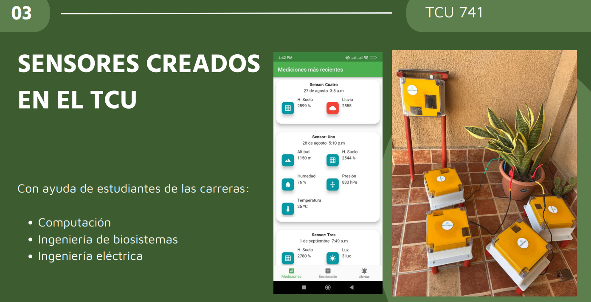
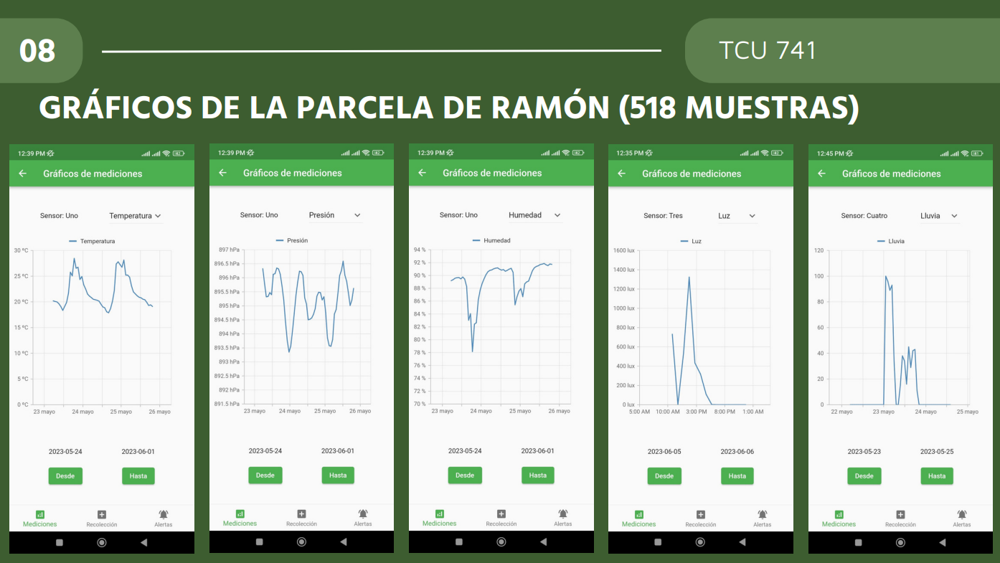
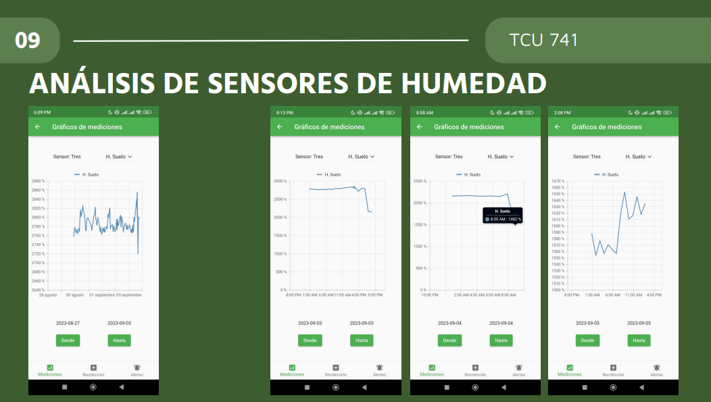
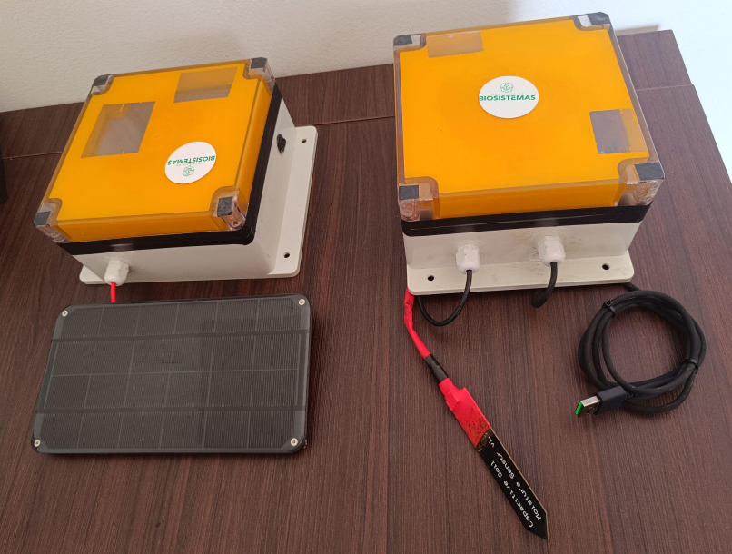
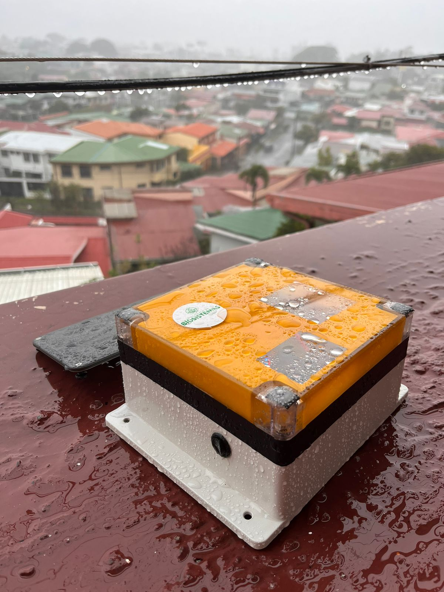
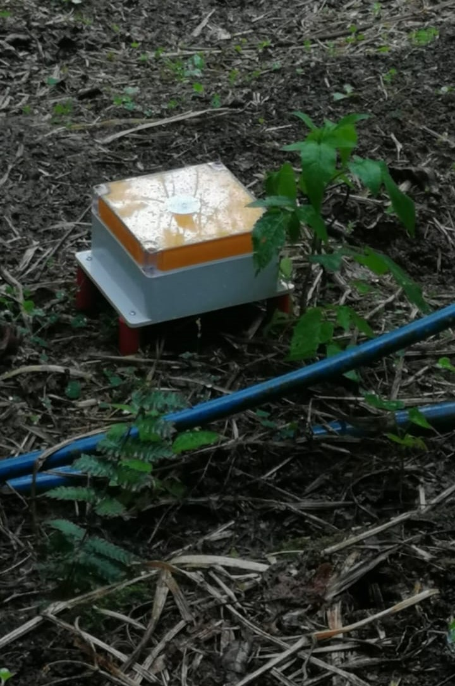

# LoRa Monitor

## Project Overview
This project involves developing a system for monitoring various field conditions affecting crop performance. It includes a comprehensive design and detailed documentation for constructing a functional, LoRa-enabled system capable of automatic data collection from any location. The goal is to gather accurate environmental and soil data to optimize crop management and improve yields

 
 

## Key Features
- **Enviromental conditions charts**: This feature allows analysis of light, soil moisture, pressure, environmental humidity, and temperature.

- **Date selection**: This feature allows viewing specific measures like soil moisture to be analyzed over a month, a year, a day, or any interval you want.

- **Automatic data collection**: The sensor with the solar panel provides automatic data collection from the other sensors, receiving and storing the data in memory until the user retrieves the collected measurements using his phone.
[This video](https://www.youtube.com/watch?v=m7cy36ZBEvo) shows how to do the data collection.

- **Off-Grid System**: This system can function in locations without electricity, phone signal, or WiFi. Instead, it utilizes batteries, LoRa, micro sd-card and solar panels to operate off-grid.
Also, it utilizes Firebase offline storage capabilities in order to keep the data on the user phone memory until the phone connects to the internet and uploads the data.
<table>
  <tr>
    <td></td>
    <td></td>
  </tr>
</table>

## Documentation index
- **Design**
This document explains how data is structured in the database, provides a high-level overview of the sensor network electronic parts, and details how LoRa communication works in our distributed system.
<a href="/design/DESIGN.MD">Design</a>
 

- **Execution instructions**
Follow this guide to run the application.
<a href="/SETUP.md">Setup Instructions</a>
 

- **Documentation**
This PDF contains a detailed construction guide, a list of needed materials and costs, team members' work distribution, iteration progress, final results, and documentation videos.
<a href="/documentation/loraMonitorDoc.pdf">Documentation </a>
 
