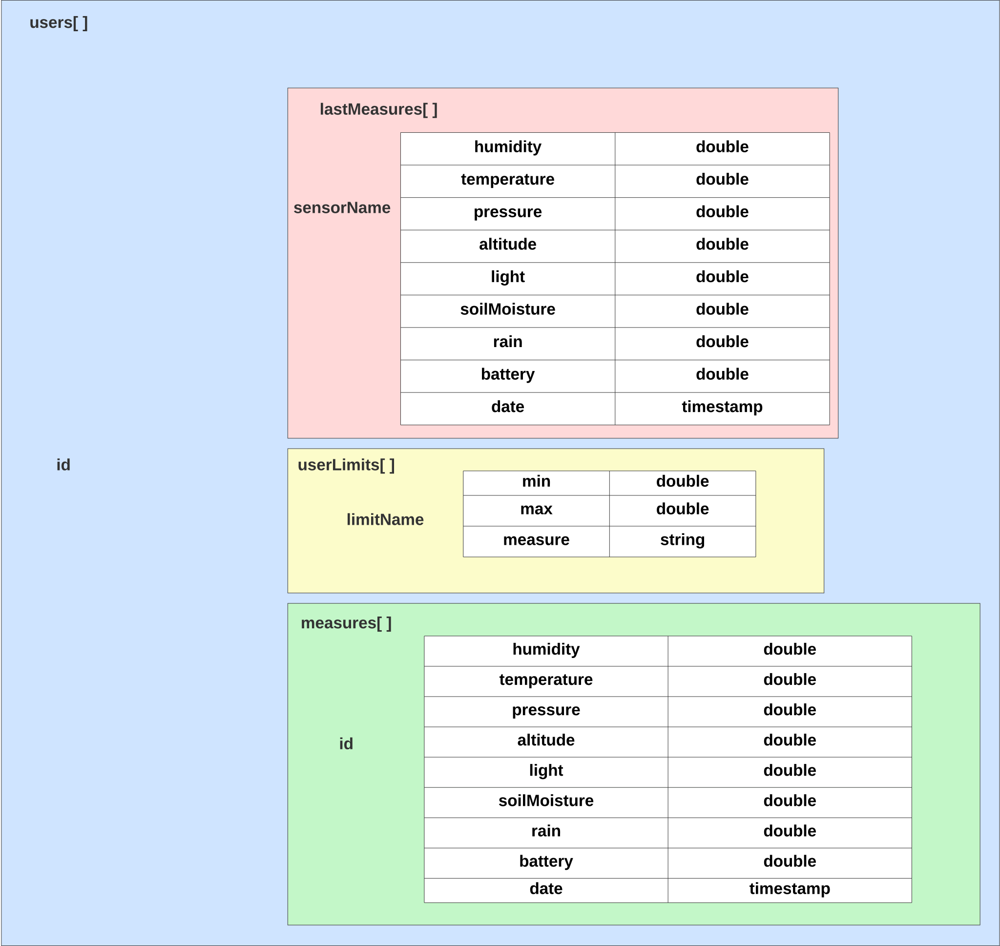

# LoRa Monitor Project Design Overview

## Data Design

In our LoRa Monitor project, we leverage Firebase as our backend solution for data management. Firebase's key advantage lies in its robust support for offline data synchronization within our mobile application, enabling uninterrupted data collection even when the device temporarily loses internet connectivity.



## Sensor Network Design

This is a high-level schematic representation illustrating the components connected to each sensor. For detailed information about the functionality of each component, please consult the PDF document: `documentation\loraMonitorDoc.pdf`.


## Communication Protocol

LoRa technology was employed for communication between the sensors, ensuring efficient long-range data transmission.


### Prerequisites to run the app:

- Ensure you have [Flutter](https://flutter.dev/) and [Dart](https://dart.dev/) installed on your development machine.
- You'll need access to a Firebase project. provided on PDF documentation\loraMonitorDoc.pdf

- **Adding Google Services JSON**

Before running the LoRa Monitor app, you need to include the Google services JSON file in your Flutter Android project. This file is necessary for Firebase integration. Here's how to do it:

1. Obtain the Google services JSON file for your Firebase project. You can find this file in your Firebase project settings.

2. Rename the JSON file to `google-services.json`.

3. Place the `google-services.json` file in the `C:\Users\User\source\repos\loraMonitor\src\lora_monitor\android\app\google-services.json` directory of your Flutter project.

```
YourProject/
├── android/
│ ├── app/
│ │ ├── google-services.json # Add the JSON file here
│ │ ├── ...
├── ...
```

### Getting Started

1. **Clone this repository to your local machine:**
   git clone https://github.com/YourUsername/loraMonitor.git

2. **Navigate to the project directory:**
   cd .\loraMonitor

3. **Install the Flutter dependencies::**
   flutter pub get

4. **Run the app:**
   flutter run
