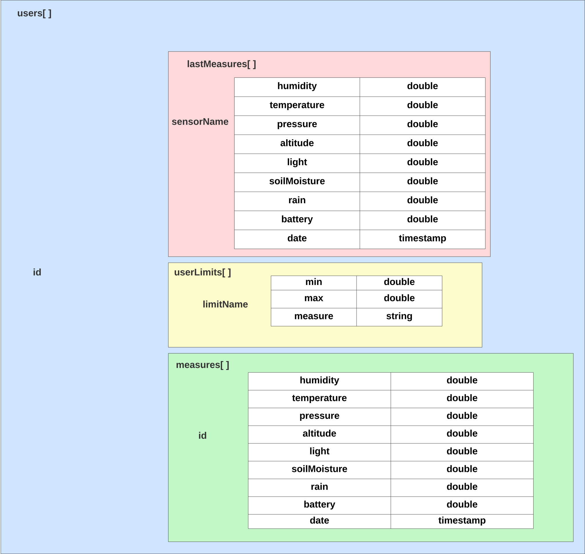
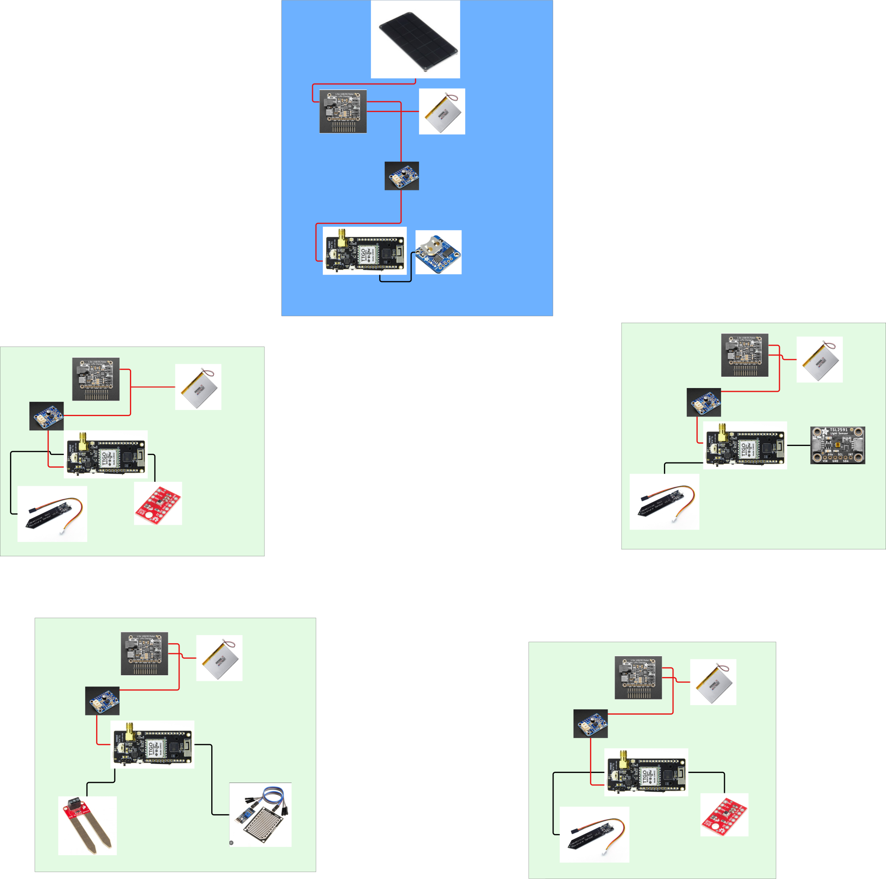
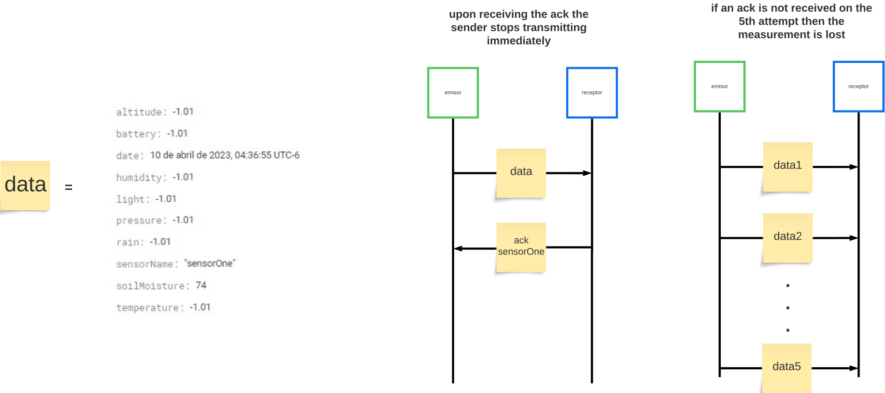

## Data Design

In our LoRa Monitor project, we leverage Firebase as our backend solution for data management. Firebase's key advantage lies in its robust support for offline data synchronization within our mobile application, enabling uninterrupted data collection even when the device temporarily loses internet connectivity.

## Sensor Network Design

This is a high-level schematic representation illustrating the components connected to each sensor. For detailed information about the functionality of each component, please consult the PDF document: `documentation\loraMonitorDoc.pdf`.

## Communication Protocol

LoRa technology was employed for communication between the sensors, ensuring efficient long-range data transmission.

